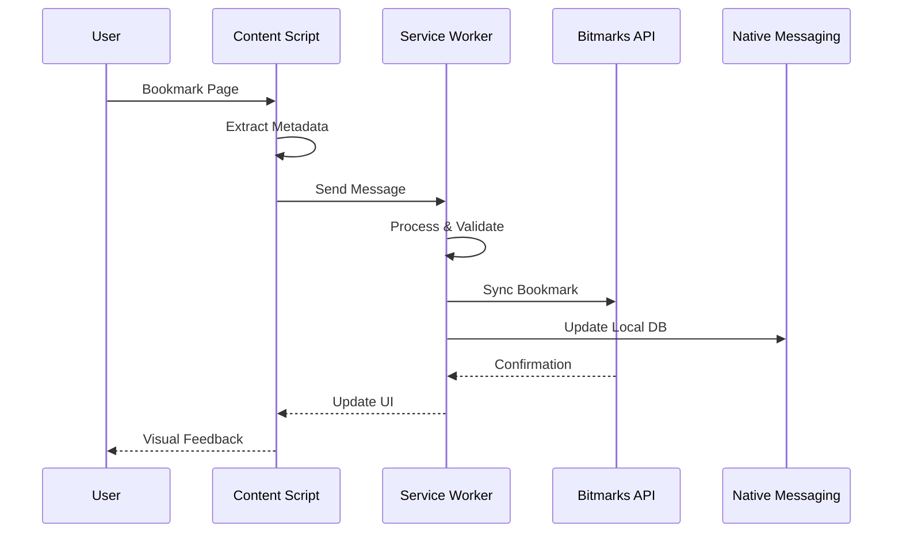

# bitmarks-ext

> Cross-browser WebExtension implementing real-time bookmark synchronization with differential privacy and homomorphic encryption capabilities

## Technical Architecture

The extension employs a multi-process architecture leveraging Manifest V3 service workers, content scripts with shadow DOM isolation, and native messaging for system integration.

### Process Architecture

```
┌────────────────────────────────────────────────┐
│              Browser Process                    │
├────────────────┬────────────────┬──────────────┤
│  Service Worker│  Content Script │  DevTools    │
│   (Background) │   (Isolated)    │  Extension   │
├────────────────┴────────────────┴──────────────┤
│            Extension Storage API                │
├─────────────────────────────────────────────────┤
│          Native Messaging Host                  │
└─────────────────────────────────────────────────┘
```

### Component Interaction Model



## Core Implementation

### Service Worker Architecture

```typescript
// Background Service Worker (Manifest V3)
class BookmarkServiceWorker {
  private syncEngine: DifferentialSyncEngine;
  private encryptor: HomomorphicEncryptor;
  private rateLimiter: TokenBucket;
  
  constructor() {
    this.syncEngine = new DifferentialSyncEngine({
      algorithm: 'myers-diff',
      chunkSize: 1024,
      compression: 'brotli'
    });
    
    this.encryptor = new HomomorphicEncryptor({
      scheme: 'CKKS',
      polyModulusDegree: 16384,
      coeffModulus: [60, 40, 40, 60],
      scale: Math.pow(2, 40)
    });
    
    this.rateLimiter = new TokenBucket({
      capacity: 100,
      refillRate: 10,
      refillInterval: 1000
    });
  }
  
  async handleBookmarkCreation(tab: chrome.tabs.Tab): Promise<void> {
    // Extract comprehensive metadata
    const metadata = await this.extractMetadata(tab);
    
    // Apply differential privacy
    const privatized = this.applyDifferentialPrivacy(metadata);
    
    // Encrypt sensitive fields
    const encrypted = await this.encryptor.encrypt(privatized);
    
    // Sync with rate limiting
    await this.rateLimiter.consume(1);
    await this.syncEngine.push(encrypted);
  }
  
  private applyDifferentialPrivacy(data: BookmarkData): BookmarkData {
    // Add Laplacian noise for ε-differential privacy
    const epsilon = 0.1;  // Privacy budget
    const sensitivity = 1.0;  // Query sensitivity
    
    return {
      ...data,
      viewCount: data.viewCount + this.laplacianNoise(sensitivity / epsilon),
      timestamp: this.discretizeTimestamp(data.timestamp, 3600) // 1-hour bins
    };
  }
  
  private laplacianNoise(scale: number): number {
    const u = Math.random() - 0.5;
    return -scale * Math.sign(u) * Math.log(1 - 2 * Math.abs(u));
  }
}
```

### Content Script Isolation

```typescript
// Content script with Shadow DOM isolation
class ContentScriptInjector {
  private shadowRoot: ShadowRoot;
  private mutationObserver: MutationObserver;
  private intersectionObserver: IntersectionObserver;
  
  constructor() {
    // Create isolated shadow root
    const host = document.createElement('div');
    host.id = 'bitmarks-extension-root';
    this.shadowRoot = host.attachShadow({ mode: 'closed' });
    
    // Inject styles with CSS-in-JS
    this.injectStyles();
    
    // Setup mutation observer for dynamic content
    this.mutationObserver = new MutationObserver(this.handleMutations.bind(this));
    this.mutationObserver.observe(document.body, {
      childList: true,
      subtree: true,
      attributes: true,
      attributeFilter: ['href', 'src']
    });
    
    // Setup intersection observer for lazy loading
    this.intersectionObserver = new IntersectionObserver(
      this.handleIntersections.bind(this),
      { threshold: [0, 0.25, 0.5, 0.75, 1] }
    );
  }
  
  private injectStyles(): void {
    const styleSheet = new CSSStyleSheet();
    styleSheet.replaceSync(`
      :host {
        all: initial;
        position: fixed;
        z-index: 2147483647;
      }
      
      .bitmarks-widget {
        container-type: inline-size;
        container-name: bitmarks;
      }
      
      @container bitmarks (min-width: 400px) {
        .bitmarks-widget {
          grid-template-columns: repeat(2, 1fr);
        }
      }
    `);
    
    this.shadowRoot.adoptedStyleSheets = [styleSheet];
  }
}
```

### WebAssembly Acceleration

```rust
// WASM module for performance-critical operations
#[wasm_bindgen]
pub struct WasmAccelerator {
    similarity_index: BKTree<String>,
    bloom_filter: BloomFilter<xxhash_rust::xxh3::Xxh3>,
}

#[wasm_bindgen]
impl WasmAccelerator {
    #[wasm_bindgen(constructor)]
    pub fn new() -> Self {
        Self {
            similarity_index: BKTree::new(levenshtein_distance),
            bloom_filter: BloomFilter::with_rate(0.001, 1_000_000),
        }
    }
    
    #[wasm_bindgen]
    pub fn find_similar(&self, url: &str, threshold: u32) -> Vec<String> {
        self.similarity_index
            .find(url, threshold)
            .into_iter()
            .map(|(item, _)| item.clone())
            .collect()
    }
    
    #[wasm_bindgen]
    pub fn probably_exists(&self, url: &str) -> bool {
        self.bloom_filter.contains(url)
    }
}
```

## Browser-Specific Implementations

### Chrome/Edge (Manifest V3)

```json
{
  "manifest_version": 3,
  "name": "Bitmarks",
  "version": "1.0.0",
  "permissions": [
    "bookmarks",
    "tabs",
    "storage",
    "unlimitedStorage",
    "webNavigation",
    "contextMenus",
    "offscreen"
  ],
  "host_permissions": ["<all_urls>"],
  "background": {
    "service_worker": "service-worker.js",
    "type": "module"
  },
  "content_scripts": [{
    "matches": ["<all_urls>"],
    "js": ["content-script.js"],
    "run_at": "document_idle",
    "all_frames": false
  }],
  "action": {
    "default_popup": "popup.html",
    "default_icon": {
      "16": "icons/16.png",
      "128": "icons/128.png"
    }
  },
  "content_security_policy": {
    "extension_pages": "script-src 'self' 'wasm-unsafe-eval'; object-src 'none'"
  }
}
```

### Firefox (WebExtensions API)

```javascript
// Firefox-specific adaptations
class FirefoxAdapter {
  async getBookmarkTree(): Promise<BookmarkTreeNode> {
    // Firefox uses promises natively
    return browser.bookmarks.getTree();
  }
  
  async setupContainers(): Promise<void> {
    // Firefox Multi-Account Containers support
    const contexts = await browser.contextualIdentities.query({});
    
    for (const context of contexts) {
      await this.createContainerProfile({
        name: context.name,
        color: context.color,
        icon: context.icon,
        cookieStoreId: context.cookieStoreId
      });
    }
  }
  
  async syncWithFirefoxSync(): Promise<void> {
    // Integration with Firefox Sync
    const syncData = await browser.storage.sync.get(null);
    await this.mergeWithLocalStorage(syncData);
  }
}
```

### Safari Web Extension

```swift
// Safari App Extension Handler
class SafariExtensionHandler: SFSafariExtensionHandler {
    override func messageReceived(
        withName messageName: String,
        from page: SFSafariPage,
        userInfo: [String : Any]?
    ) {
        switch messageName {
        case "bookmarkPage":
            handleBookmarkCreation(page: page, data: userInfo)
        case "syncBookmarks":
            performIncrementalSync()
        default:
            break
        }
    }
    
    private func handleBookmarkCreation(
        page: SFSafariPage,
        data: [String: Any]?
    ) {
        page.getPropertiesWithCompletionHandler { properties in
            guard let url = properties?.url else { return }
            
            let bookmark = Bookmark(
                url: url,
                title: properties?.title,
                metadata: data
            )
            
            self.syncEngine.addBookmark(bookmark)
        }
    }
}
```

## Privacy & Security Implementation

### Differential Privacy Engine

```typescript
class DifferentialPrivacyEngine {
  private readonly epsilon: number = 0.1;  // Privacy budget
  private readonly delta: number = 1e-5;   // Failure probability
  
  addGaussianNoise(value: number, sensitivity: number): number {
    const sigma = sensitivity * Math.sqrt(2 * Math.log(1.25 / this.delta)) / this.epsilon;
    return value + this.gaussianRandom(0, sigma);
  }
  
  private gaussianRandom(mean: number, stdDev: number): number {
    // Box-Muller transform
    const u1 = Math.random();
    const u2 = Math.random();
    const z0 = Math.sqrt(-2 * Math.log(u1)) * Math.cos(2 * Math.PI * u2);
    return z0 * stdDev + mean;
  }
  
  anonymizeTimestamp(timestamp: number, binSize: number): number {
    // Temporal binning for k-anonymity
    return Math.floor(timestamp / binSize) * binSize;
  }
}
```

### Homomorphic Encryption

```typescript
// Using SEAL library via WASM
class HomomorphicEncryption {
  private context: seal.Context;
  private publicKey: seal.PublicKey;
  private secretKey: seal.SecretKey;
  private evaluator: seal.Evaluator;
  
  constructor() {
    // Setup CKKS parameters
    const parms = seal.EncryptionParameters(seal.SchemeType.ckks);
    parms.setPolyModulusDegree(16384);
    parms.setCoeffModulus(
      seal.CoeffModulus.Create(16384, [60, 40, 40, 60])
    );
    
    this.context = new seal.Context(parms);
    const keyGen = new seal.KeyGenerator(this.context);
    this.publicKey = keyGen.createPublicKey();
    this.secretKey = keyGen.secretKey();
    this.evaluator = new seal.Evaluator(this.context);
  }
  
  encryptNumber(value: number): seal.Ciphertext {
    const encoder = new seal.CKKSEncoder(this.context);
    const encryptor = new seal.Encryptor(this.context, this.publicKey);
    
    const plaintext = new seal.Plaintext();
    encoder.encode(value, Math.pow(2, 40), plaintext);
    
    const ciphertext = new seal.Ciphertext();
    encryptor.encrypt(plaintext, ciphertext);
    
    return ciphertext;
  }
  
  computeOnEncrypted(
    cipher1: seal.Ciphertext,
    cipher2: seal.Ciphertext,
    operation: 'add' | 'multiply'
  ): seal.Ciphertext {
    const result = new seal.Ciphertext();
    
    if (operation === 'add') {
      this.evaluator.add(cipher1, cipher2, result);
    } else {
      this.evaluator.multiply(cipher1, cipher2, result);
      this.evaluator.relinearizeInplace(result, this.relinKeys);
      this.evaluator.rescaleToNextInplace(result);
    }
    
    return result;
  }
}
```

## Performance Optimizations

### Virtual Scrolling for Large Lists

```typescript
class VirtualScroller {
  private itemHeight: number = 40;
  private buffer: number = 5;
  private scrollTop: number = 0;
  private containerHeight: number = 600;
  
  getVisibleRange(totalItems: number): [number, number] {
    const scrollBottom = this.scrollTop + this.containerHeight;
    
    let startIndex = Math.floor(this.scrollTop / this.itemHeight) - this.buffer;
    let endIndex = Math.ceil(scrollBottom / this.itemHeight) + this.buffer;
    
    startIndex = Math.max(0, startIndex);
    endIndex = Math.min(totalItems - 1, endIndex);
    
    return [startIndex, endIndex];
  }
  
  calculateOffset(index: number): number {
    return index * this.itemHeight;
  }
}
```

### IndexedDB with Dexie

```typescript
class BookmarkDatabase extends Dexie {
  bookmarks!: Dexie.Table<IBookmark, string>;
  syncLog!: Dexie.Table<ISyncEntry, number>;
  
  constructor() {
    super('BitmarksDB');
    
    this.version(1).stores({
      bookmarks: '&id, url, *tags, createdAt, updatedAt',
      syncLog: '++id, timestamp, operation'
    });
    
    // Compound indexes for complex queries
    this.version(2).stores({
      bookmarks: '&id, url, *tags, createdAt, updatedAt, [url+deviceId]'
    }).upgrade(tx => {
      // Migration logic
      return tx.table('bookmarks').toCollection().modify(bookmark => {
        bookmark.deviceId = bookmark.deviceId || generateDeviceId();
      });
    });
  }
  
  async searchBookmarks(query: string): Promise<IBookmark[]> {
    // Use Dexie's WhereClause for efficient querying
    return this.bookmarks
      .where('tags')
      .startsWithAnyOfIgnoreCase(query.split(' '))
      .or('url')
      .startsWithIgnoreCase(query)
      .limit(100)
      .toArray();
  }
}
```

## Testing Strategy

### E2E Testing with Puppeteer

```typescript
describe('Extension E2E Tests', () => {
  let browser: puppeteer.Browser;
  let page: puppeteer.Page;
  
  beforeAll(async () => {
    browser = await puppeteer.launch({
      headless: false,
      args: [
        `--disable-extensions-except=${path.resolve('dist')}`,
        `--load-extension=${path.resolve('dist')}`
      ]
    });
  });
  
  test('Bookmark creation flow', async () => {
    page = await browser.newPage();
    await page.goto('https://example.com');
    
    // Trigger extension action
    const extensionId = 'your-extension-id';
    const extensionPage = await browser.newPage();
    await extensionPage.goto(`chrome-extension://${extensionId}/popup.html`);
    
    // Interact with extension UI
    await extensionPage.click('#bookmark-button');
    await extensionPage.waitForSelector('.success-message');
    
    // Verify bookmark was created
    const bookmarks = await extensionPage.evaluate(() => {
      return chrome.bookmarks.search({ url: 'https://example.com' });
    });
    
    expect(bookmarks).toHaveLength(1);
  });
});
```

## Build Configuration

### Webpack Configuration

```javascript
module.exports = {
  entry: {
    'service-worker': './src/service-worker.ts',
    'content-script': './src/content-script.ts',
    'popup': './src/popup.tsx',
    'options': './src/options.tsx'
  },
  output: {
    path: path.resolve(__dirname, 'dist'),
    filename: '[name].js'
  },
  module: {
    rules: [
      {
        test: /\.tsx?$/,
        use: 'ts-loader',
        exclude: /node_modules/
      },
      {
        test: /\.wasm$/,
        type: 'webassembly/async'
      }
    ]
  },
  experiments: {
    asyncWebAssembly: true
  },
  optimization: {
    splitChunks: {
      chunks: 'all',
      cacheGroups: {
        vendor: {
          test: /[\\/]node_modules[\\/]/,
          name: 'vendor'
        }
      }
    }
  }
};
```

## License

MIT